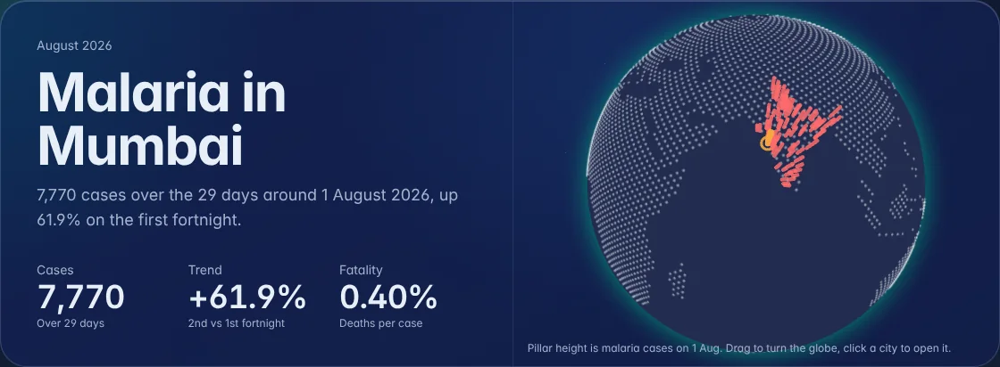
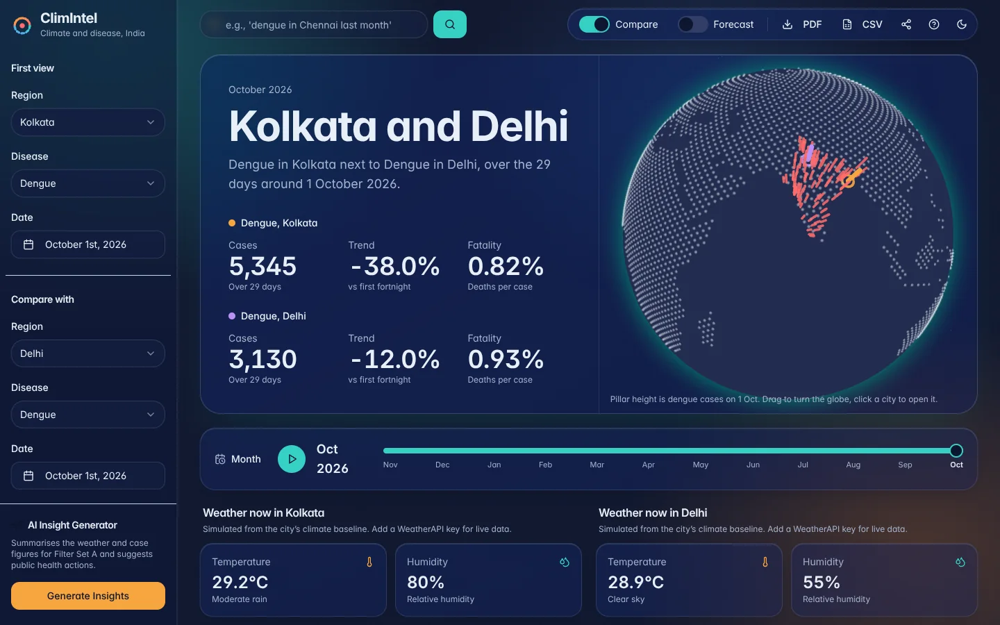
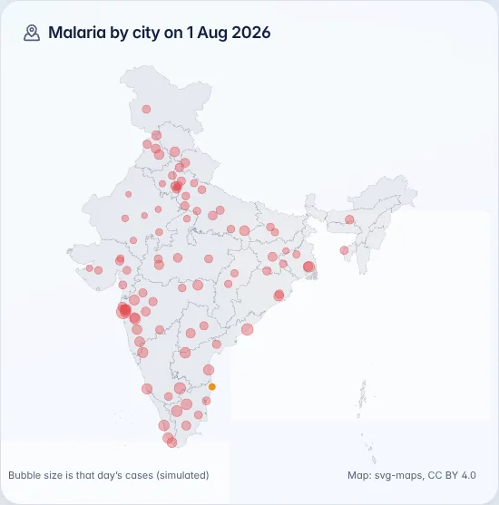
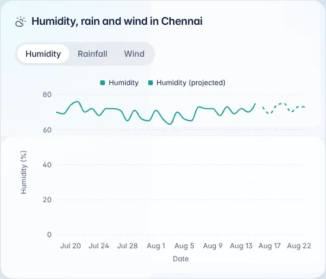
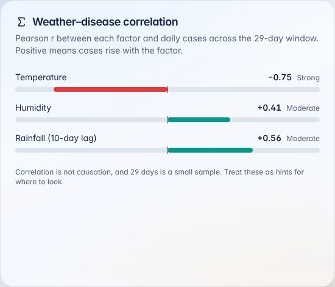
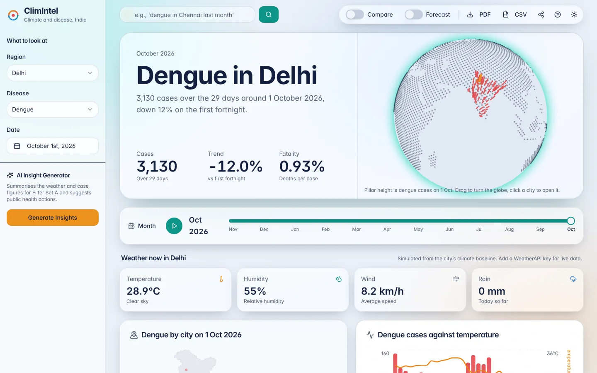
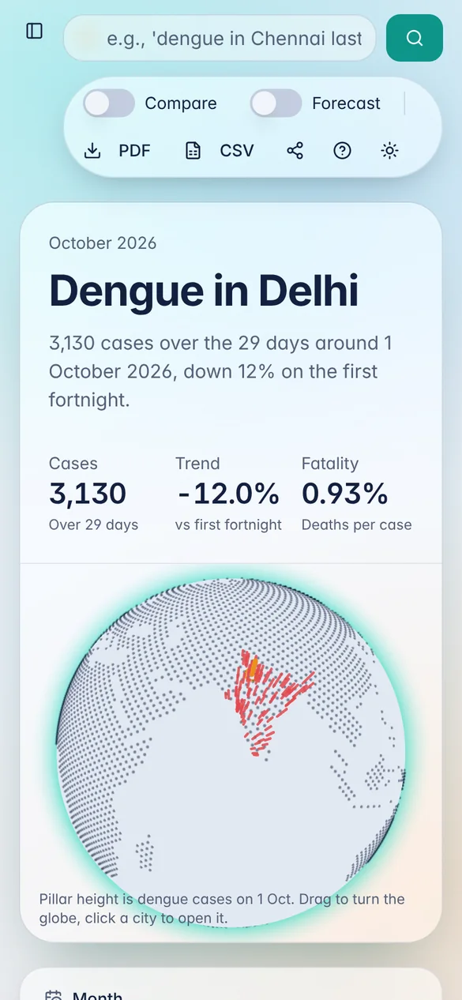

<div align="center">

# ClimIntel

**How heat and monsoon rain shape dengue, malaria, cholera and typhoid across 92 Indian cities.**

An interactive climate–health dashboard with a 3D globe, weather and disease trends,
correlation analysis and AI-written public health insights.


</div>



> **Data notice.** Disease case numbers are **simulated** by a transparent, documented model (see [How the data works](#how-the-data-works)). They are not real surveillance figures and must not be used for health decisions. Current weather is live when a WeatherAPI key is set and simulated otherwise, and the dashboard always says which one you are seeing.

## What it does

Pick a city, a disease and a month. ClimIntel shows how many cases there were, what the weather was doing, where in India the disease was heaviest, and how closely cases tracked temperature, humidity and rain. Gemini can then summarise the picture and suggest public health actions.

| | |
|---|---|
| **3D globe** | Every city rises as a pillar sized by that day's cases. Drag to turn it, click a city to open it. Built with plain three.js on public-domain Natural Earth land data. |
| **Month timeline** | Scrub or play through the last 12 months and watch the whole dashboard move with it. |
| **City map** | A flat map of India with every city sized by cases, for precise reading. |
| **Trends** | Daily cases, temperature, humidity, rainfall and wind, with an optional 7-day projection. |
| **Weather–disease correlation** | Pearson *r* between daily cases and temperature, humidity and 10-day lagged rainfall, with a plain-language strength. |
| **Compare** | Two cities or diseases side by side across every panel. |
| **AI insights** | Gemini reads the window's actual figures and correlations and writes a short summary with 2–3 recommendations. Save them to compare later. |
| **Search** | Type "malaria in Chennai August". It uses Gemini when a key is set and a keyword parser otherwise. |
| **Export & share** | A PDF of the dashboard, a CSV of the daily data, and a link that reopens the exact view. |



<table>
  <tr>
    <td width="33%"></td>
    <td width="33%"></td>
    <td width="33%"></td>
  </tr>
</table>

<table>
  <tr>
    <td width="70%"></td>
    <td width="30%"></td>
  </tr>
</table>

## Design

The palette comes from the two forces the app is about. **Monsoon teal** stands for rain and humidity, **heat saffron** for temperature, and **fever coral** marks disease cases. Panels are frosted glass over a slow aurora of the teal and saffron, with a light and a dark theme. Headlines use Bricolage Grotesque and body text uses Instrument Sans.

The layout respects `prefers-reduced-motion` (the globe stops swaying and numbers stop counting), works down to phone width, and keeps keyboard focus visible. If a browser has WebGL turned off, the globe steps aside and the rest of the dashboard carries on.

## Getting started

Requires Node.js 20 or newer.

```bash
git clone https://github.com/Sandeepsrinivasan-14/ClimIntel.git
cd ClimIntel
npm install
cp .env.example .env.local   # optional: add keys, see below
npm run dev                  # http://localhost:3000
```

Everything runs without keys. Add them to `.env.local` to switch on the live parts:

| Variable | Enables | Get one |
|---|---|---|
| `GEMINI_API_KEY` | AI insights and AI search | [Google AI Studio](https://aistudio.google.com/apikey) |
| `GEMINI_MODEL` | Choose the Gemini model (default `gemini-3.5-flash`) | |
| `WEATHER_API_KEY` | Live current weather | [WeatherAPI.com](https://www.weatherapi.com/) |

| Script | Does |
|---|---|
| `npm run build` | Production build. Type errors and lint errors fail it. |
| `npm run typecheck` | `tsc --noEmit` |
| `npm run lint` | ESLint (`next/core-web-vitals` and `next/typescript`) |
| `npm run regions` | Regenerates `src/lib/regions.ts` from the climate sample |

### Deploying

The app deploys to Vercel as a standard Next.js project. Import the repository, add `GEMINI_API_KEY` (and optionally `WEATHER_API_KEY`) under Environment Variables, and deploy.

## How the data works

Every series is **deterministic**: the same city and date always give the same numbers, whichever range you are viewing.

1. **Climate baseline** (`src/lib/regions.ts`). Each city has a November baseline for temperature, humidity, rainfall and wind, generated from a sample weather dataset in `scripts/data/`.
2. **Daily weather** (`src/lib/climate.ts`). The baseline follows a seasonal curve. The temperature swing grows with latitude, humidity rises in the south-west monsoon, and the Tamil Nadu coast follows the north-east monsoon instead. A slow multi-day wave and small noise sit on top.
3. **Daily cases** (`src/lib/data.ts`). Mosquito-borne diseases peak near 28 °C and rise with humidity and with rain over the previous 10 days (breeding sites). Water-borne diseases rise with warmth and recent rain. Deaths use a per-disease case fatality ratio.
4. **Projection.** The 7-day forecast runs the same model forward. It shows what the model does, not a prediction of real outbreaks.

Because cases are generated from the weather, the correlation panel demonstrates the analysis on data with known structure.

## Project structure

```
src/
├── app/
│   ├── page.tsx              # Dashboard: state, URL sync, exports, layout
│   ├── actions.ts            # Server actions: weather, AI insight, search
│   └── globals.css           # Design tokens, glass surfaces, aurora
├── ai/
│   ├── genkit.ts             # Genkit + Gemini config
│   └── flows/                # Insight summary and search-parsing prompts
├── components/dashboard/
│   ├── hero.tsx              # Headline, key numbers, globe
│   ├── globe/                # three.js globe (lazy-loaded, WebGL fallback)
│   ├── interactive-map.tsx   # Flat India map
│   └── …                     # Charts, filters, timeline, tour
└── lib/
    ├── regions.ts            # 92 cities with coordinates and climate baselines (generated)
    ├── climate.ts            # Deterministic daily weather model
    ├── data.ts               # Diseases, case model, KPIs, correlations, CSV
    ├── weather.ts            # Live weather with simulated fallback
    ├── keyword-search.ts     # Offline search fallback
    └── india-map.ts          # State outlines for the flat map
scripts/
└── gen_regions.py            # Builds regions.ts from the climate sample
```

## Credits

- Globe land data: [Natural Earth](https://www.naturalearthdata.com/) (public domain) via [world-atlas](https://github.com/topojson/world-atlas).
- India outline map: [svg-maps](https://github.com/VictorCazanave/svg-maps) by Victor Cazanave, [CC BY 4.0](https://creativecommons.org/licenses/by/4.0/).
- UI primitives: [shadcn/ui](https://ui.shadcn.com/) and Radix. Charts: [Recharts](https://recharts.org/).

## License

[MIT](LICENSE) © Sandeep Srinivasan S. The India outline keeps its own CC BY 4.0 license.
